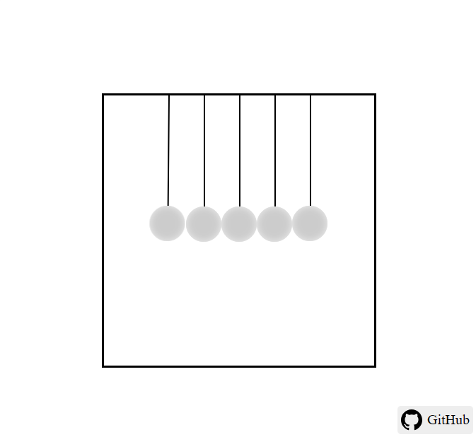

# Newton's Cradle Animation

This project is a simple and visually appealing CSS animation inspired by Newton's Cradle, a popular physics demonstration. It features swinging balls animated using CSS `@keyframes` to mimic the back-and-forth motion.

## Features

- **Smooth Animation**: Realistic swinging motion using CSS animations.
- **Responsive Design**: The layout adapts to various screen sizes well.
- **Interactive GitHub Link**: A fixed GitHub button in the bottom-right corner opens in a new tab.

## Preview

<!---->


## How to Use

1. **Clone the Repository**:
   ```bash
   git clone https://github.com/R-Tharanka/newtons-cradle-animation.git
